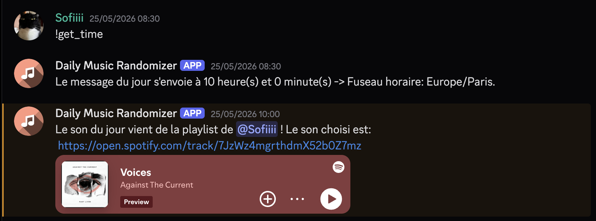
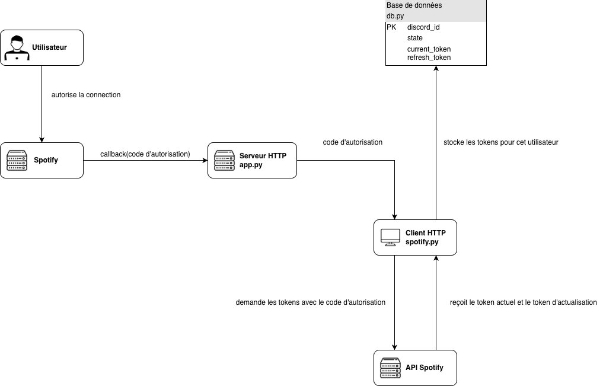
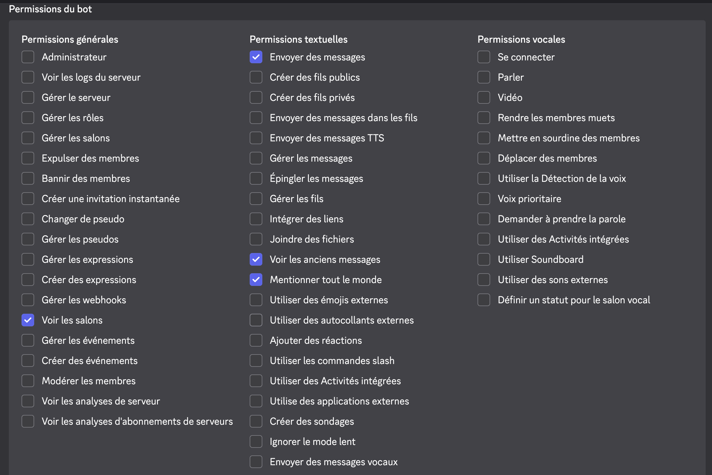

# Daily Music Randomizer

## Développeuse

- [Sofia CETIN](https://github.com/SofiaCetin)

## Présentation

Le "Daily Music Randomizer" est un bot Discord visant à envoyer chaque jour un titre aléatoire d'une des playlist Spotify des utilisateurs enregistrés dans la base de données du robot. L'utilisateur peut donner le droit à l'application d'effectuer des requêtes API sur les playlists de son compte Spotify. Le but est de pouvoir découvrir les titres écoutés par les autres personnes du serveur de manière complètement aléatoire.

Chaque jour à une heure précise, le bot choisit un utilisateur au hasard, puis choisit un titre aléatoire dans la playlist qu'il a enregistré dans la base de données du bot.



*Un exemple d'une commande et d'un message envoyé chaque jour*

## Utilisation

### Fonctionnement

Afin de pouvoir récupérer les informations concernant une playlist Spotify d'un utilisateur spécifique, le programme python reçoit et envoie des requêtes HTTP via les modules Flask et requests. 

Flask permet de créer un serveur web en Python et établir des routes pour recevoir des requêtes HTTP, notamment dans le cas où il nous faut un endpoint. Requests permet d'envoyer des requêtes HTTP vers des API externes. Ils permettent donc un modèle complèmentaire d'une architecture API: le serveur HTTP(Flask), et le client HTTP(requests).



*Un diagramme pour mieux comprendre*

Spotify renvoie la réponse de chaque requête au format JSON. On peut donc y extraire les tokens d'accès ou d'actualisation d'un utilisateur, qui nous permettent de faire une nouvelle requête pour obtenir les informations de l'utilisateur Spotify en question.

Afin de ne pas continuellement demander des tokens, nous venons stocker celui-ci ainsi que le token d'actualisation dans une base de données avec les ID Discord des utilisateurs en tant que clé primaire. Cela nous permet également de sauvegarder la playlist enregistrée des utilisateurs et donc rendre le processus du message journalier automatique, sans devoir continuellement demander ces informations.

### Commandes Discord

Pour se concentrer plus sur la partie façade que back-end, le coeur de ce projet est un bot Discord avec lequel les utilisateurs peuvent interagir. Nous avons donc à notre disposition, une série de commandes possibles. Les commandes s'effectuent dans les canaux textuels du serveur avec le préfixe "!".

#### Commandes générales:

<details>
<summary><u>!link</u></summary>

Prototype:
```
!link
```

Permet d'obtenir un lien envoyé par le bot en message privé, afin de donner les autorisations(ou "scopes") Spotify nécessaires pour lui permettre d'enregistrer des playlist.

</details>

<details>
<summary><u>!register_playlist</u></summary>

Prototype:
```
!register_playlist PLAYLIST_ID
```

Permet d'enregistrer la playlist où le bot piochera un titre au hasard. La playlist peut être privée ou public du moment que l'utilisateur est le créateur ou un collaborateur. Il faut que l'utilisateur ait préalablement lié son compte Spotify au bot.

L'ID d'une playlist Spotify se situe dans son lien.

```
Exemple:

https://open.spotify.com/playlist/37i9dQZF1DZ06evO3RZl6M?si=f30b2a8c822b45ba
                                  ----------------------
                                    id de la playlist

L'ID est 37i9dQZF1DZ06evO3RZl6M.
La commande s'utilisera ainsi:

!register_playlist 37i9dQZF1DZ06evO3RZl6M
```

</details>

<details>
<summary><u>!change_playlist</u></summary>

Prototype:
```
!change_playlist PLAYLIST_ID
```

Permet à l'utilisateur de changer la playlist enregistrée dans la base de données. A noter qu'un utilisateur ne peut enregistrer qu'une seule playlist à la fois.

</details>

<details>
<summary><u>!my_playlist_info</u></summary>

Prototype:
```
!my_playlist_info
```

Permet à l'utilisateur d'obtenir les informations de la playlist qu'il a enregistré dans la base de données.

</details>

<details>
<summary><u>!remove_playlist</u></summary>

Prototype:
```
!remove_playlist
```

Permet à l'utilisateur de retirer la playlist enregistrée dans la base de données.

</details>

<details>
<summary><u>!unlink</u></summary>

Prototype:
```
!unlink
```

Retire l'utilisateur de la base de données, y compris les playlist enregistrées. L'utilisateur devra de nouveau se lier avec la commande !link s'il souhaite se ré-enregistrer.

</details>

<details>
<summary><u>!get_time</u></summary>

Prototype:
```
!get_time
```

Permet de voir à quelle heure le bot envoie le message journalier.

</details>

#### Commandes administrateur:

<details>
<summary><u>!change_time</u></summary>

Prototype:
```
!change_time HOURS MINUTES
```

Permet de changer l'heure à laquelle le bot envoie le message journalier, à condition que
l'utilisateur qui a effectué la commande ait les permissions administrateur sur le serveur.

</details>

## Implémenter ce bot sur mon propre serveur

Ce projet utilisant l'API Web de Spotify en mode développement, il n'est pas possible de pouvoir interagir et stocker des tokens à grande échelle. Nous ne pouvons autoriser que 6 utilisateurs/tokens(y compris la personne qui a crée l'application) à effectuer des requêtes API dans une application Spotify en cours de développement pour des raisons de sécurité.

Si vous souhaitez utiliser ce bot sur votre serveur, il vous faudra donc déployer vos propres applications Discord et Spotify basées sur ce code source, mais également héberger la base de données.


#### Etapes nécessaires

<details>
<summary><u>Créer les applications nécessaires</u></summary>

##### Spotify

Pour créer une application Spotify, rendez-vous sur le [portail des développeurs](https://developer.spotify.com/).

*Notez qu'un abonnement Spotify Premium est requis pour pouvoir effectuer des requêtes avec votre application.*

Indiquez le nom et la description de votre application. Quant à l'URL de redirection, celle-ci va dépendre de si vous hébergez votre projet localement ou sur un serveur distant.

Si vous hébergez votre projet localement, vous pouvez mettre l'adresse locale et la route callback qui sera crée dans le code source, par exemple:

```
http://127.0.0.1:3000/callback
```

Si vous utilisez un serveur distant, vous pouvez alors mettre le domaine de votre projet suivi du /callback.

Votre application est créée. Vous pouvez spécifiez les utilisateurs avec lesquels vous souhaitez interagir avec l'API, avec leurs adresses-emails dans la section User Management de votre application.

##### Discord

Rendez-vous sur le [portail de développement](https://discord.com/developers/home) de Discord pour créer votre bot.

Personnalisez-le comme vous le souhaitez. Pour garantir le fonctionnement du programme, rendez-vous dans la section *OAuth2*. Descendez jusqu'à la sous-partie *Générateur d'URL OAuth2*, cochez "Bot" et cochez la section qui suit comme cela:



Vous pourrez donc obtenir une URL pour inviter votre bot dans le serveur que vous souhaitez.

Nous nous intéresserons au token des applications dans la partie qui suit.

</details>

<details>
<summary><u>Cloner le code source et initialiser les variables d'environnement</u></summary>

Une fois les applications initialisées, nous possédons les tokens nécessaires au fonctionnement du programme. Vous pouvez cloner le dépôt Git sur votre machine ou votre serveur distant.

Nous devons initialiser les variables d'environnement afin que le code fonctionne bien. Ces variables doivent impérativement rester secrètes car elles contiennent des informations sensibles, et nous ne voulons pas que d'autres gens se servent de nos tokens pour effectuer des requêtes et potentiellement récupérer des données confidentielles.

Que vous initialisez le programme localement ou sur un serveur distant, le fichier .env devra contenir les variables suivantes:

##### APP_SECRET

Clé secrète en hexadécimal(de 24 bits ou plus de préférence, pour un maximum de sécurité) à générer vous-même pour l'application Flask.

*Vous pouvez utiliser le module Python [secrets](https://docs.python.org/3/library/secrets.html) pour générer des clés hexadécimales sécurisées.*

##### BOT_TOKEN

Le token secret de votre bot Discord. Vous pouvez trouver celui ci dans le menu *Installation* dans le [portail des développeur](https://discord.com/developers/home).

##### CHANNEL_ID

L'ID du canal du serveur Discord où vous avez invité votre bot, et où vous souhaitez que le message journalier apparaisse. Vous pouvez activer le mode développeur sur l'application, cela va donc montrer l'option *"Copier l'ID du canal"* lorsque vous ferez un clic droit sur un canal.

##### DATABASE_URL

Le lien de votre base de données afin de la connecter au module **psycopg2** et pouvoir permettre au programme d'interagir dessus. Généralement, les services distants fournissent cette URL.

Si cependant vous lancez le programme sur une base de données locale, vous devez remplir cette variable comme suit:

```
"db_name=nom_de_votre_db user=utilisateur host=votre_adresse_locale password=mot_de_passe_de_la_db"
```


##### REDIRECT_URL

L'URL de redirection pour le serveur Flask du bot. Il doit être identique à celui spécifié pour votre application Spotify lorsque vous l'avez créee et doit se finir par "/callback".

##### SPOTIFY_CLIENT_ID

Le token publique de votre application Spotify que vous pouvez trouver dans les paramètres de votre application.

##### SPOTIFY_CLIENT_SECRET

Le token secret de votre application Spotify que vous pouvez trouver dans les paramètres de votre application.


</details>

<details>
<summary><u>Initialiser la base de données</u></summary>

Le programme supporte les bases de données de type [PostgreSQL](https://www.postgresql.org/).

- Si vous êtes sur un serveur distant: vous devez suivre les procédures de celui-ci mais généralement elle reste la même, vous devez créer le serveur de la base de données et le lier en renseignant son URL dans la variable d'environnement **DATABASE_URL**.

- Si vous hébergez localement le projet pour le tester: vous devez créer votre base de données, à l'aide d'outils comme par exemple pgAdmin4 ou via le terminal, puis renseigner les informations comme dit plus haut dans la variable **DATABASE_URL**.

</details>

<details>
<summary><u>Lancer le programme</u></summary>

Nous devons lancer deux programmes Python afin de permettre au bot Discord et à l'application Flask de fonctionner en même temps.

Pour lancer le bot Discord, vous pouvez simplement exécuter dans le terminal:

```bash
python3 main.py
```

Pour lancer l'application Flask, nous nous servirons du module gunicorn, afin de bénéficier de plus de sécurité et de stabilité dans le cas où le serveur doit gérer plusieurs paquets en même temps:

```bash
gunicorn -w 2 -b 0.0.0.0:PORT app:app
```

Le paramètre -w sert à indiquer le nombre de workers. 2 suffisent pour ce projet. Le paramètre -b sert à indiquer sur quel adresse IP et sur quel port écouter. Quant à la fin, nous indiquons à gunicorn sur quel module se baser(**app\.py**) et quel objet(app).

</details>

